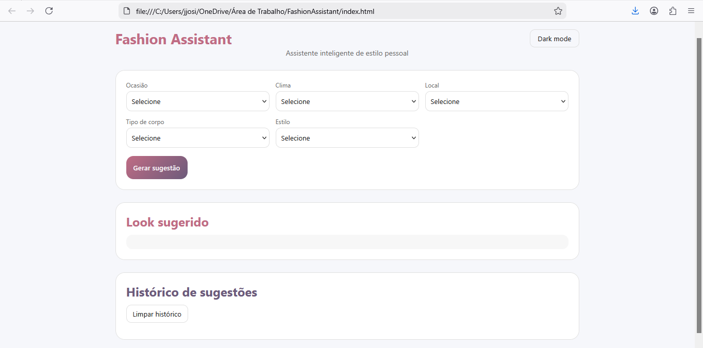
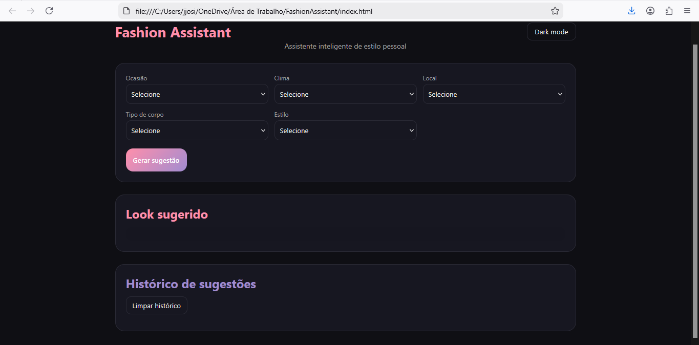

# Fashion Assistant

Aplicação web desenvolvida em HTML, CSS e JavaScript que sugere looks personalizados com base em preferências do usuário.

<<<<<<< HEAD
Projeto criado com foco em aprendizado em front-end, lógica de programação, organização de código e experiência do usuário.
=======
## Sobre o projeto
>>>>>>> 491bb89f32feee3f748be915a9a271b21024d02b

---

## Objetivo do projeto

- Praticar desenvolvimento front-end
- Trabalhar manipulação do DOM
- Aplicar lógica condicional
- Organizar estrutura de projeto
- Simular um sistema de recomendação
- Criar uma interface moderna e funcional
- Aprimorar experiência do usuário

---

## Funcionalidades

- Geração de looks personalizados
- Filtros por:
  - Ocasião
  - Clima
  - Local
  - Tipo de corpo
  - Estilo (Y2K, Quiet Luxury, Streetwear, Cottagecore, Coquette/Balletcore, Glam Maximalista)
- Histórico de sugestões
- Limpar histórico de sugestões
- Dark mode
- Armazenamento no localStorage
- Interface moderna e responsiva
- Organização por componentes visuais

---

## Tecnologias
=======
## Tecnologias utilizadas
>>>>>>> 491bb89f32feee3f748be915a9a271b21024d02b

- HTML5
- CSS3
- JavaScript (Vanilla)
<<<<<<< HEAD
- localStorage
- Git
- GitHub
=======

## Funcionalidades

- Seleção de ocasião, temperatura e local
- Escolha de tipo de corpo
- Escolha de estilos de moda:
  - Y2K  
  - Quiet Luxury  
  - Streetwear  
  - Cottagecore  
  - Coquette / Balletcore  
  - Glam Maximalista
- Sugestão automática de look
- Histórico dos últimos looks sugeridos
- Salvamento das preferências do usuário com localStorage

## Conceitos praticados

- Manipulação de eventos
- Arrays e objetos
- Funções reutilizáveis
- Persistência de dados no navegador
- Melhoria de experiência do usuário (UX)

## Objetivo

Este projeto tem como objetivo demonstrar conhecimentos fundamentais de front-end e lógica de programação, sendo voltado para oportunidades de **estágio em desenvolvimento front-end**.

## Possíveis melhorias futuras

- Adicionar dark mode
- Expandir o catálogo de looks
- Tornar o layout totalmente responsivo
- Implementar filtros adicionais de estilo
>>>>>>> 491bb89f32feee3f748be915a9a271b21024d02b

---

## Estrutura do projeto

fashion-assistant/
│
├── index.html
├── style.css
├── script.js
│
├── screenshots/
│ ├── tela-principal.png
│ ├── geracao-look.png
│ ├── historico.png
│ ├── dark-mode.png
│
└── README.md

---

## Demonstração da aplicação

### Tela principal

### Geração de look

### Histórico de sugestões

### Dark mode

---

## Aprendizados

- Manipulação do DOM
- Lógica condicional
- Organização de código front-end
- Persistência de dados com localStorage
- Estruturação de projeto
- Experiência do usuário (UX)
- Criação de layouts modernos
- Pensamento orientado a produto

---

## Próximas melhorias

- Sistema de favoritos
- Perfis de usuário
- Exportação de looks
- Integração com API externa
- Versão mobile-first
- Integração com backend
- Sistema de recomendações mais inteligentes
